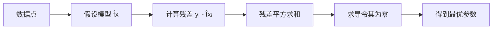

# 最小二乘法

最小二乘法（Least Squares Method）是一种数学优化方法，通过==最小化误差的平方和==来找到数据的最佳拟合函数。

## 核心思想

给定一组数据点 $(x_1, y_1), (x_2, y_2), \ldots, (x_n, y_n)$，寻找函数 $f(x)$ 使得残差平方和最小：

$$S = \sum_{i=1}^{n} \left( y_i - f(x_i) \right)^2$$

## 线性拟合推导

以最简单的直线拟合 $y = ax + b$ 为例：

$$S(a, b) = \sum_{i=1}^{n} (y_i - ax_i - b)^2$$

对 $a$ 和 $b$ 分别求偏导并令其为零：

$$\frac{\partial S}{\partial a} = -2\sum_{i=1}^{n} x_i(y_i - ax_i - b) = 0$$

$$\frac{\partial S}{\partial b} = -2\sum_{i=1}^{n} (y_i - ax_i - b) = 0$$

解出：

$$a = \frac{n\sum x_i y_i - \sum x_i \sum y_i}{n\sum x_i^2 - \left(\sum x_i\right)^2}$$

$$b = \bar{y} - a\bar{x}$$

> [!tip] 为什么用"平方"？
> - 消除正负误差相互抵消的问题
> - 数学上可导，便于求解
> - 误差服从正态分布时，等价于 [[最大似然估计]]

## 矩阵形式

对于多元线性回归 $\mathbf{y} = X\boldsymbol{\beta} + \boldsymbol{\varepsilon}$，最小二乘解为：

$$\hat{\boldsymbol{\beta}} = (X^T X)^{-1} X^T \mathbf{y}$$

> [!note] 正规方程
> 上式称为**正规方程**（Normal Equation），是最小二乘的闭合解。当 $X^T X$ 不可逆时，需要用 [[正则化]] 或伪逆。

## 应用场景

- **[[线性回归]]** — 回归分析的基础
- **曲线拟合** — 多项式拟合、非线性拟合
- **信号处理** — 滤波、预测
- **[[机器学习]]** — 许多模型的损失函数本质上就是最小二乘

## Python 示例

```python
import numpy as np

# 数据点
x = np.array([1, 2, 3, 4, 5])
y = np.array([2.1, 3.9, 6.2, 7.8, 10.1])

# 最小二乘拟合直线 y = ax + b
A = np.vstack([x, np.ones(len(x))]).T
a, b = np.linalg.lstsq(A, y, rcond=None)[0]

print(f"拟合结果: y = {a:.2f}x + {b:.2f}")
# 输出: y = 1.99x + 0.06
```

## 可视化理解



> [!abstract] 总结
> 最小二乘法是连接 [[统计学]] 和 [[机器学习]] 的核心方法，理解它是深入学习回归分析、优化理论的基础。

## 相关主题

- [[梯度下降]] — 当正规方程计算量太大时的替代方案
- [[岭回归]] — 带 L2 正则化的最小二乘
- [[LASSO]] — 带 L1 正则化的最小二乘
